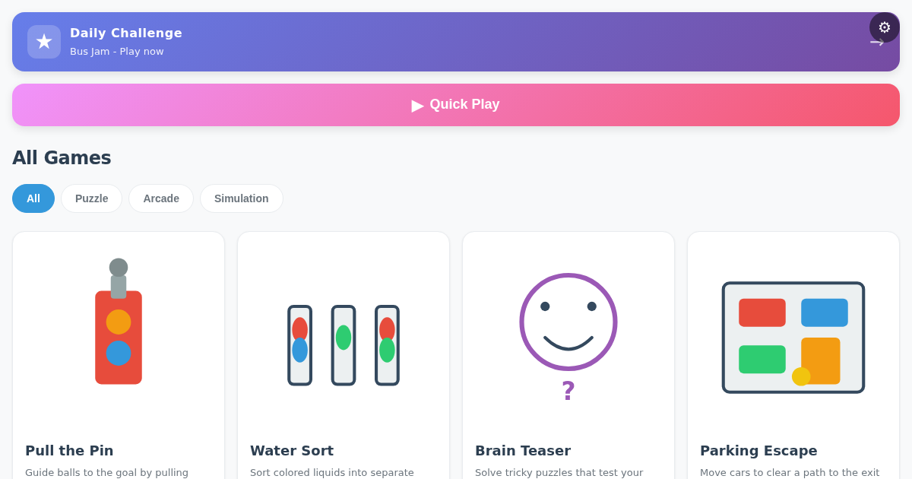

# Mobile Gaming

Browser-based puzzle and arcade games inspired by mobile game ads — all running on the open web with Phaser 3 and Three.js.

**Live:** [mobile-gaming.pages.dev](https://mobile-gaming.pages.dev)

[](https://mobile-gaming.pages.dev)

## 🎮 Games

### Puzzle Games

**[Brain Teaser](https://mobile-gaming.pages.dev/brain-teaser/)** — Lateral-thinking puzzles that test your wit
- Sort items by weight, navigate mazes, and solve logic puzzles
- 10+ handcrafted levels

**[Water Sort](https://mobile-gaming.pages.dev/water-sort/)** — Sort colored liquids by pouring between tubes
- Classic relaxation puzzle gameplay
- Progressive difficulty with more colors and tubes

**[Parking Escape](https://mobile-gaming.pages.dev/parking-escape/)** — Slide vehicles to clear a path for the red car
- Unblock-style puzzle game
- Strategic movement challenges

**[Pull the Pin](https://mobile-gaming.pages.dev/pull-the-pin/)** — Guide balls to the goal by pulling pins in the right order
- Physics-based pin puzzles
- Avoid hazards and collect rewards

**[Save the Character](https://mobile-gaming.pages.dev/save-the-character/)** — Choose the right action to save the character from danger
- Multiple-choice survival scenarios
- Test your judgment and reflexes

**[Bus Jam](https://mobile-gaming.pages.dev/bus-jam/)** — Sort passengers by color onto matching buses
- Color-matching puzzle with route planning
- Fill buses to capacity to complete levels

**[Merge Games](https://mobile-gaming.pages.dev/merge-games/)** — Merge matching tiles to reach the goal tier
- Combine matching items to level up
- Strategic planning for optimal merges

### Arcade Games

**[Crowd Runner](https://mobile-gaming.pages.dev/crowd-runner/)** — Grow your crowd through math gates and defeat the boss
- Auto-runner with math-based crowd growth
- Dodge obstacles and power up for the final boss

**[Bridge Race](https://mobile-gaming.pages.dev/bridge-race/)** — Collect blocks and build bridges to race to the finish
- 3D auto-runner with bridge-building mechanics
- Race against AI competitors

**[Giant Runner](https://mobile-gaming.pages.dev/giant-runner/)** — Collect matching orbs to grow and defeat the boss in this thrilling auto-runner
- 3D growth-focused runner game
- Match colors to power up for boss battles

**[Jelly Shift](https://mobile-gaming.pages.dev/jelly-shift/)** — Reshape a jelly blob to fit through walls in this addictive auto-runner
- Shape-shifting 3D runner
- Quick reflexes required

**[Makeover Run](https://mobile-gaming.pages.dev/makeover-run/)** — Style your character through upgrade stations and hit the runway
- Fashion-themed 3D auto-runner
- Collect style items and show off on the runway

### Simulation Games

**[Satisfying Clean](https://mobile-gaming.pages.dev/satisfying-asmr/)** — Swipe to clean the surface — satisfying ASMR gameplay
- Relaxing cleaning simulation
- ASMR-style satisfaction

## 🚀 Running Locally

```bash
# Install dependencies
npm ci

# Start development server
npm run dev

# Build for production
npm run build

# Preview production build
npm run preview

# Run tests
npm test                 # Unit tests (Vitest)
npm run test:e2e         # E2E tests (Playwright)
npm run test:levels      # Level validation
```

The dev server runs on `http://localhost:5173/` and auto-discovers all games from `src/games/*/`.

## 🏗️ Project Structure

```
mobile-gaming/
├── src/
│   ├── games/          # Individual game directories
│   │   └── <game>/     # Each game has: index.html, game.js, state.js, renderer.js, input.js, styles.css, levels.json
│   ├── hub/            # Main game lobby/selector
│   └── shared/         # Shared utilities (audio, scoring, lifecycle)
├── levels/             # Level JSON files for each game
├── public/             # Static assets (manifest, service worker, redirects)
├── tests/              # Unit tests (Vitest) and E2E tests (Playwright)
└── docs/               # Project documentation
```

## 🧪 Testing

- **121 unit test files** covering game logic, state management, and scoring
- **E2E tests** with Playwright (mobile Chrome & Safari)
- **Bundle size enforcement**: 3000KB JS, 150KB CSS budget
- **Level validation**: All games must have ≥ 3 levels

## 🚢 Deployment

**Production URL:** https://mobile-gaming.pages.dev

- **Platform:** Cloudflare Pages
- **CI/CD:** Argo Workflows on `iad-ci` cluster
- **Trigger:** Automatic on push to `main` branch
- **Build:** `npm ci && npm test && npm run test:levels && npm run build`

The reusable build and deployment definitions live in the public
[`jedarden/declarative-config`](https://github.com/jedarden/declarative-config)
GitOps repository.

## 🎨 Technologies

- **Phaser 3** — 2D game engine (puzzle games)
- **Three.js** — 3D rendering (arcade runners)
- **Vite** — Build tool with hot module replacement
- **Vitest** — Fast unit testing
- **Playwright** — Cross-browser E2E testing

## 📱 PWA Support

Install as a progressive web app on mobile devices for offline play. The app includes:
- Service worker for offline caching
- App manifest for mobile installation
- Responsive design for all screen sizes

## 📄 License

MIT License — Copyright (c) 2026 Jed Arden

See [LICENSE](LICENSE) for details.
